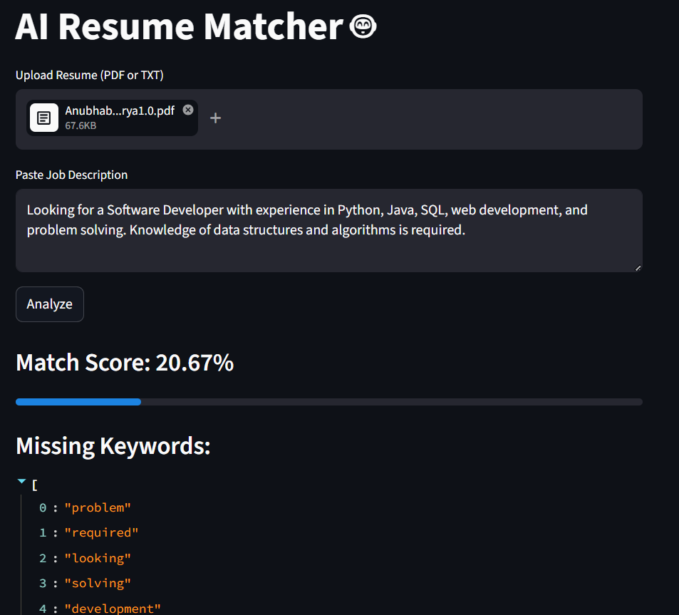

# AI Resume Matcher 🤖

An AI-based web application that compares a resume with a job description and calculates how well they match using Natural Language Processing (NLP).

[](https://resume-matcher-7zccmht894wypotg6lgy79.streamlit.app/)

## 🚀 Features
- 📄 Upload resume (PDF or TXT)
- 🧠 Match score using TF-IDF & cosine similarity
- 📊 Visual progress bar for match percentage
- 🎯 Extract missing keywords from job description
- 🌐 Simple UI built with Streamlit

## 🛠️ Tech Stack
- Python
- Scikit-learn
- Streamlit
- PyPDF2
- NLP (TF-IDF, Cosine Similarity)

## 📸 Screenshot



## ▶️ How to Run

```bash
pip install -r requirements.txt
streamlit run app.py